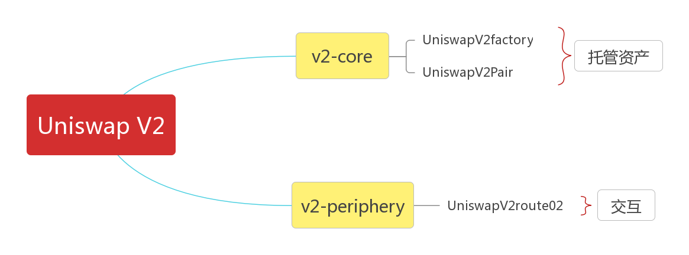

# UniswapV2

### **我对UniswapV2的代码进行了中文注释，如有需要请打开各自具体的sol文件进行查看，希望能帮助到您，如有任何错误或者建议希望能及时联系我**.

### 介绍：

 

Uniswap V2是一种基于以太坊的去中心化交易协议，旨在提供快速、安全、无信任的代币交换服务。它是Uniswap协议的第二个版本，是对第一个版本的改进和升级。

Uniswap V2的核心特点包括以下几个方面：

1. 去中心化交易：Uniswap V2使用智能合约来执行交易，而不需要传统的中心化交易所。这意味着用户可以直接通过他们的以太坊钱包进行交易，无需信任或依赖第三方中介。
2. 自动化做市商模型：Uniswap V2采用自动化做市商模型，其中流动性提供者可以将资金存入流动性池中，并通过提供资金来帮助形成交易对的市场价格。这种模型使得任何人都可以成为流动性提供者，并从交易手续费中获得奖励。
3. 常量乘积函数：Uniswap V2使用常量乘积函数作为交易价格计算模型。根据这个函数，交易所需的两种代币的数量乘积在交易前后保持不变，从而决定了交易价格。这种机制可以在没有订单簿的情况下进行交易，并保持相对简单和高效。
4. ERC-20代币支持：Uniswap V2支持以太坊上的ERC-20代币进行交易。用户可以通过选择不同的代币对进行交易，并且任何人都可以创建新的代币对，只需提供相应的流动性即可。
5. 流动性挖矿：Uniswap V2引入了流动性挖矿机制，通过奖励流动性提供者来吸引更多的资金注入流动性池。流动性提供者可以获得代币奖励作为对其提供流动性的补偿，如果市场价格剧烈波动，您存入的资金可能面临损失。

